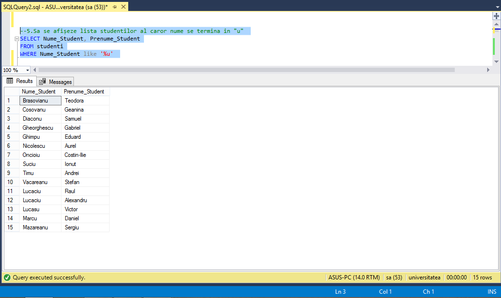
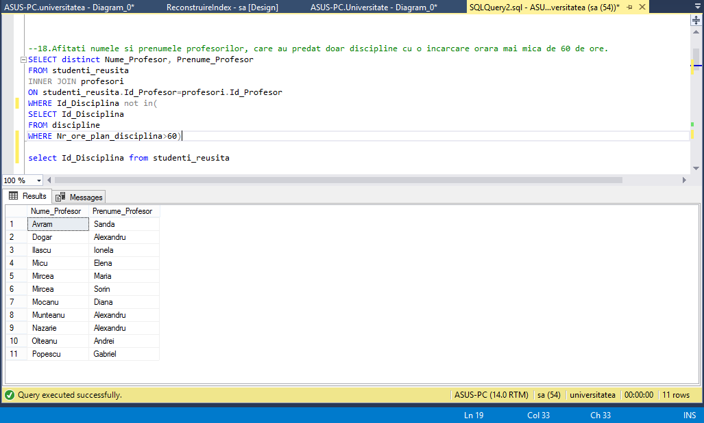
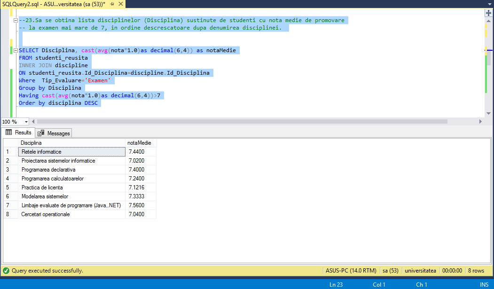
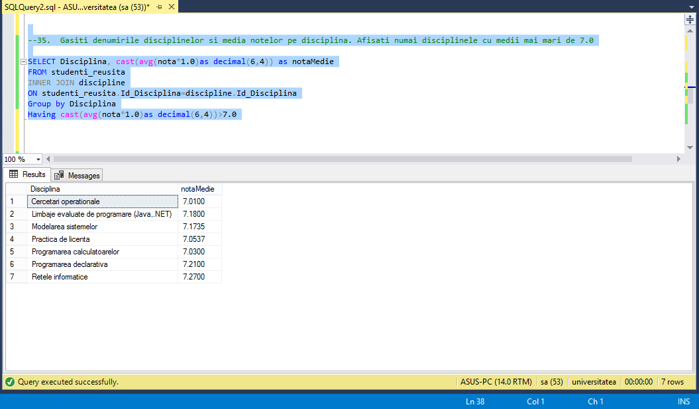
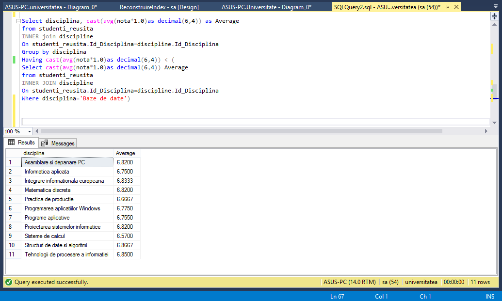

# Sarcina
## Sa se scrie interogarile in limbajul SQL si sa se afiseze raspunsurile la aceste interogari:

>Interogarile realizate sunt cu indicii 5, 18, 23, 35, 38.

*5.Sa se afișeze lista studentilor al caror nume se termina in "u"*

*18. Afitati numele si prenumele profesorilor, care au predat doar discipline cu o incarcare orara mai mica de 60 de ore.* 

*23.Sa se obtina lista disciplinelor (Disciplina) sustinute de studenti cu nota medie de promovare la examen mai mare de 7, in ordine descrescatoare dupa denumirea disciplinei.*

*35.  Gasiti denumirile disciplinelor si media notelor pe disciplina. Afisati numai disciplinele cu medii mai mari de 7.0.*

*38. Furnizati denumirile disciplinelor cu o medie mai mica decat media notelor de la disciplina Baze de date.* 

