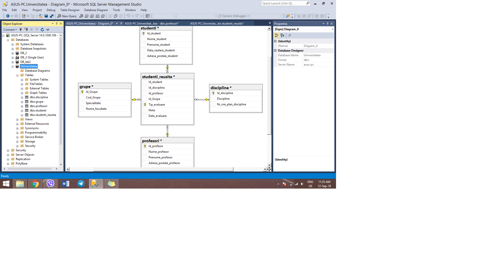

Sarcini Practice
1. Care din numerele prezentate mai jos pot fi introduse intr-un cimp de tipul DECIMAL(4,1)?

Raspuns: b)116.2

2. Fie [Col1] din tabelul de mai jos de tip INT si [Col2] este de tip DECIMAL(2,1). Ce tip de date trebuie sa fie [Col3] pentru a pastra rezultatul urmatoarei expresii Col1* Col3. 

Raspuns: DECIMAL(2,1).

3. Creati o baza de date numita Universitatea cu proprietati implicite. In cadrul acestei baze de date, creati tabelele (grupe, discipline,studenti, profesori,studenti_reusita).
Diagrama bazei de date:

