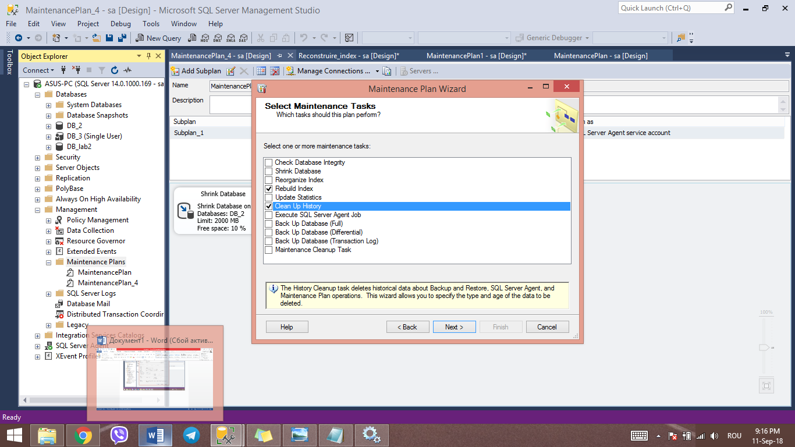
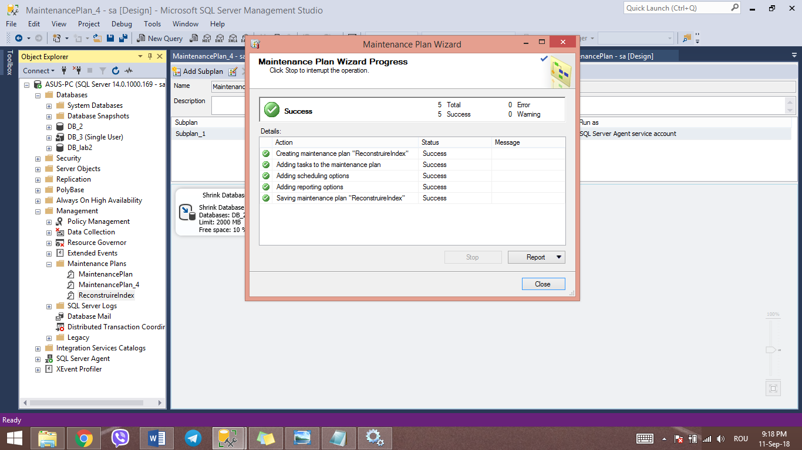

# Data_Base_Lab
Sarcini Practice Laboratorul 2
1.	Creați o bază de date plasată fizic în mapa MyDocuments/Data, fixînd o creștere a fișierului primar a bazei de 16MB cu o creștere de 128MB și a log-ului de 64MB cu limita de creștere de 1024MB. Pentru fișierele secundare să se definească un FileGroup nou implicit, setînd creșterea fișierelor secundare de 64MB cu limita de 1024MB. 

•	Properties for my new and first database
 
•	Autogrowth sizes
 
2.	Creați o bază de date, unde fișierul log sa fie fizic plasat în mapa MyDocuments\Log, numele
fișierului log in mediul sistemului de operare trebuie să se deosebească de cel logic definit in
schema fizică. Este important ca baza de date creată sa fie compatibilă cu sistemul MS SQL
Server 2017 și ea să fie accesibilă numai unui singur utilizator într-un moment de timp.

•	This data base is accesible to a single user and is compatible with SQL Server 2017

3.	Creați planul de întreținere a bazei de date, construită în sarcina 1. Spațiul neutilizat de fișierele bazei de date trebuie îndepartat atunci când el atinge mărimea 2000Mb. Spațiul eliberat trebuie să fie returnat sistemului de operare. Aceasta operatiune trebuie să ruleze în fiecare vineri, la ora 00:00. Raportul executării planului de întreținere trebuie salvat în dosarul MyDocuments\SQL _event_logs. Inițializați executarea planului. Dupa executare, verificati rezultatele în fișierul log.
•	Crearea unui nou plan de mentinanță

4.	Creați planul de întreținere a bazei de date, construite in exercițiul 2. Numele planului va fi: ,,Reconstruire index". În cadrul acestui plan, sistemul trebuie să realizeze reconstruirea indecșilor numai asupra tabelelor de baza (exclusiv viziunilor) din toate schemele care există în baza de date în cauză. Spațiul liber pe pagină trebuie să fie 10%. Sortarea indecșilor trebuie să se realizeze în tempdb. După reconstruire trebuie să urmeze colectarea statisticilor complete despre indecșii reconstruiți. Al treilea pas al planului trebuie să constituie sarcina de ștergere a istoriei despre operațiile de Backup-Restore ce au avut loc pe SQL Server. Trebuie șters istoricul care este mai vechi de 6 saptămani. Acest plan trebuie să fie executat în fiecare primă duminică a lunii. Creați dosarul
MyDocuments\SQL_reports. Raportul de executare a planului trebuie sa fie adăugat în acest fișier. Inițializati executarea planului. Dupa executare, verificati rezultatele in fișierul log generat.

